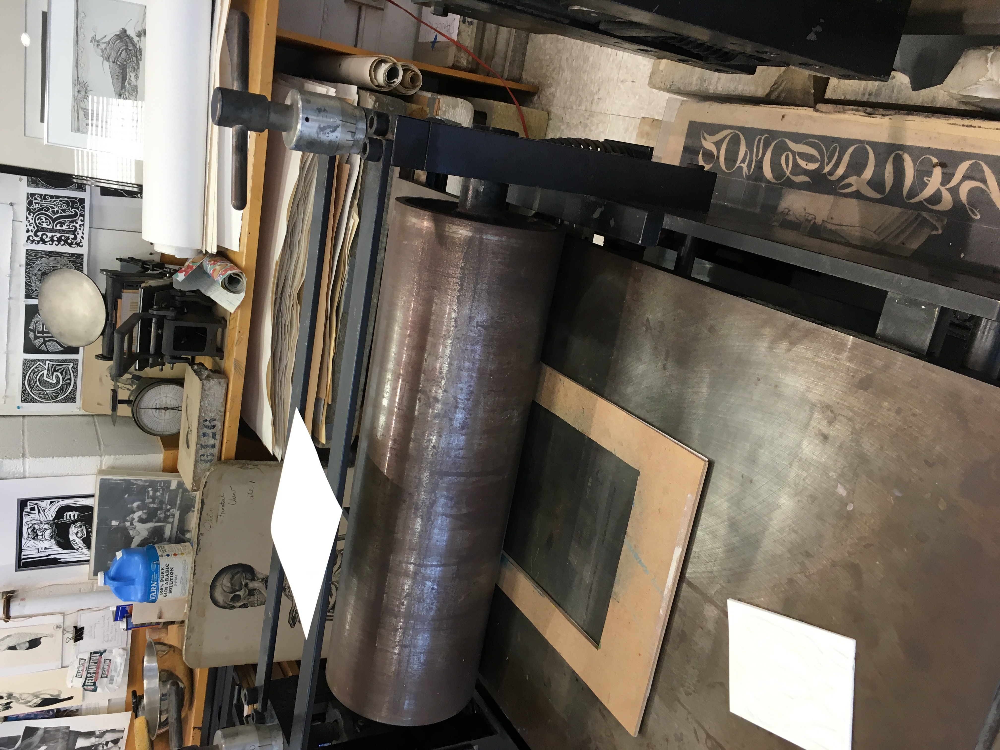
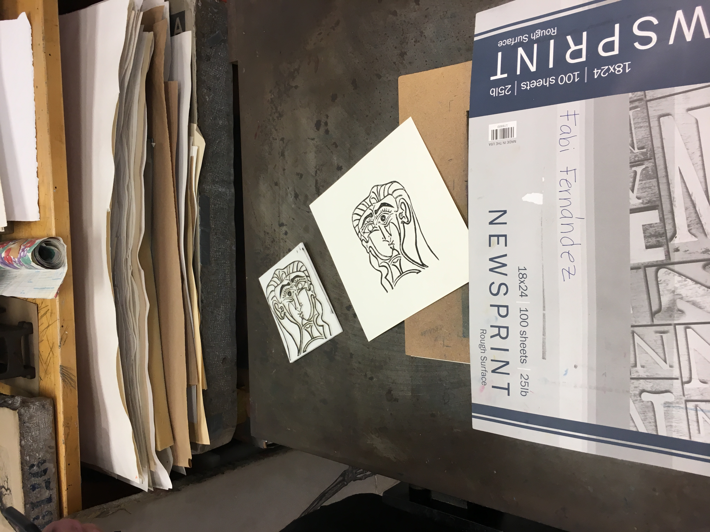

<h1>3dPrintedLino</h1>
Replicating lino print making through the use of a 3d printer and free software.

Pick an image that you would like to print and save it to your computer.  
</img>

Open up the image with paint 3d. It comes free and preinstalled with windows 10. (Photoshop has tools to select specific colors that would make this process even easier, if you have access to that paid software. 
</img> 

Choose the magic select tool. I recommend that you do not crop out the borders as it is helpful to have a common base for the various prints. (This will make more sense later)
 
</img> 
Pick a color you want to isolate first. Using the magic select tool add all of the chosen color and the border, but remove every other color. The tool gets smarter and becomes better at selecting the desired colors overtime, but expect to spend several minutes. Click done to end the magic select tool. Drag the selected image away from the unselected image using the drag tool that appears. Cut the image you selected, that isolated only one color and then click menu, new to create a new portrait. Do not save the inital image that you downloaded because you are going to need to isolate various other layers and you want the base image to do so. 

With the isolated image, crop out the background white if it appears. 
</img> 
Save this image as an svg file.

Repeat this process of isolating each color until you have every color in your image isolated.
 
</img></img></img>
</img>  

<h4>I chose to use fusion360 as my cad software to edit the .svg files to make them ready to print on the 3d printer, but any other cad program should work. (Fusion360 has a free student license, and it works on both PCs and Macs.)</h4>

Right click on the base component and create a new component, activate it, and name it accordingly.  
</img></img> 
                                                                                       
Open up the .svg file in your cad software. Highlight the entire sketch and click extrude. Extrude the sketch up 6mm. 
</img></img> 
                                                                                        
Repeat creating/naming/activating a new component, highlighting the sketch and then extruding it to 6mm until all of the isolated colors have been extruded.

Hide all of the bodies, and show all of the sketches for every component. Create a rectangular sketch bordering the entire set of sketches. 
 </img>

Extrude this border 4mm and create a join with each of the isolated extrusions. You can measure this joined extrusion to ensure that it is 10mm. (The jig I used was 10mm, you can change this extrusion depth, but the top layer has to be equal to the size of the jig you create later.) 

Save the joined 3d extrusion as a .stl file. Repeat the process of creating a base extrusion and joining it with each isolated extrusion. Print out the .stl file. (I used simplify3d, which is not free to create the format my 3d printer needs, but there are various other free slicing software programs that often come included with 3d printers.)

Apply paint to the extruded side until it looks like the paint covers the entire surface well.
  </img> 

Create a cardboard jig that is the same height (or at least close) to the height of the highest extrusion.
 </img> 

Place the 3d printed lino inside the jig and then place a piece of paper on top of it. Place a larger piece of paper on top of the printing paper to ensure little movement in the press stage.

Roll the print through.
 </img></img>

Repeat this process with using all of the paint colors and the respective 3d printed parts. Ensure that the printed paper is aligned before rolling it through each time. 

